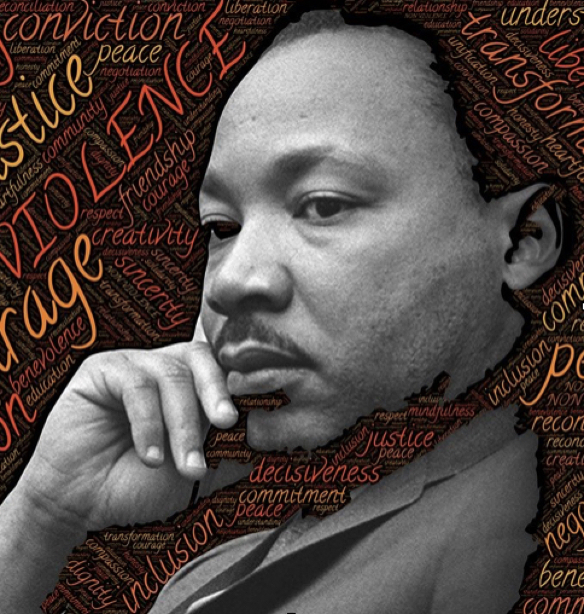

# The Protester’s Oath

<table>
<tr><td width="60%">

1. *I will not be violent.*
2. *I will not bring a weapon, defensive or offensive, to a protest.*
3. *I will stop violence, crime and vandalism, or record it, if I feel it is safe to do so and I can remain non-violent.*
4. *I will bear witness and record peaceful and non-violent acts of protest.*
5. *I will help those who are hurt when I am able.*
6. *I will listen to the advice and direction of protest leaders and report problems with violence and crime I see.*
7. *I will eat and sleep beforehand so that I can control my emotions.*
8. *I will recognize when I am emotionally out of control and remove myself from situations to calm down.*
9. *I will not protest at night during a riot or a curfew that has been ordered to quell violence.*

</td>
<td width="40%">
  

  
</td></tr>
</table>
<table>
<tr>
<td>

### Reasoning:

The power of protest is to reveal truth in the face of unjust power through non-violent action.

Violence negates that revelation, burying the truth in a haze of fear and anger. If the audience of the protest fears you, they will not hear you. Non-violence means peaceful civil disobedience and useful mischief against immoral laws and power.

People who are out of power, minorities,  immigrants, the non traditional and those at the fringes of society have learned this. But we all must learn this if there is to be change.

We are taught to meet injustice with violence, that violence is somehow justified in that context. Violence is never justified, and further, the reacting person gives up their power when they respond with violence. The power of non-violence is its ability to win sympathy and to clearly demonstrate the injustice of an aggressor, an oppressor, the object of the protest.  

Please take this oath so that your voice will be heard and the real power of non-violence activated.

### Explanation:

Being non-violent is the power that a protest holds, that gives it a voice for change.

Protesting involves committing of acts of useful civil disobedience that is peaceful, non-violent and non-vengeful. These acts may be inconvenient to others, but brings attention to the injustices that are being protested. Indiscriminate vandalism isn’t useful mischief, throwing things is not useful mischief. Examples of useful mischief are blocking traffic, sit ins, disobeying immoral laws, or defacing of symbols of oppression and hate. 

Violence is where protest ends and riots begin. Violence gives the object of a protest an excuse to commit violent acts and to suppress the protest. Violence overshadows the reason for the protest.  

</td>
<td>

Vandalizing bystander property, breaking windows or spraying graffiti does not help a cause because the object of the protest will use that as an excuse to discount its message. Vandalism will be used as an excuse to respond with disproportionate force which endangers the protest. Vandalism will be seen as violence by many bystanders. One exception is vandalism of symbols of oppression.

Throwing things at police, military or anyone will be seen as an act of violence and will be responded to with disproportionate force. Throwing any projectile will be seen as an act of violence even if it is non-lethal. Water bottles, rocks, eggs, fireworks, shoes and other like objects can hurt someone if they hit them in unfortunate ways. One exception is glitter or soap bubbles which can’t be construed as violent. 

Weapons must not be brought to a protest because it enables violence whether that weapon is used defensively or offensively. Do not bring a weapon to a protest, no guns, knives, batons or any instrument that can be used to hurt someone. A weapon is not a means of defence, it is a temptation to use violence.

Stopping violence around the protest helps people stay focused on what is important: staying non-violent. This must be done in a non-violent way. Help each other to quell anger and respond with love so that the message of the protest will be heard.

Being a witness to the protest helps to bring the protest’s message to a wider audience and gain the sympathy of potential allies. The protest will be understood if violence is met with love and by example over time.

Help people who are hurt only if you are coming to help from a place of certainty, safety, knowledge of your surroundings and of the risk you are taking. Helping the hurt will keep people healthy so that they can continue to participate. 

</td>
<td vlign="top" style="vertical-align:top">

By listening to the leaders of the protest, you can coordinate with protest activities and help communicate coherent and clear messages. The first responsibility of the protest and protesters is to communicate to bystanders what the problem is and what remedy is required.

When the police are informed, they do not have an excuse to work against the protest. Police should come to see their duty as protecting the protester, property and bystanders. By cooperating with police, they can come to understand the motivations of the protest. Committing crimes is self serving and not the purpose of protest.

Eating and sleeping before attending a protest will help to control feelings of anger. The human body is built to short circuit the brain in dangerous situations and will create the desire for violence. This short circuit becomes more sensitive as we become tired and hungry.

When we become emotional it is more difficult to control ourselves. We must not respond to violence with violence, even when feeling angry or fearful. We must stand if we can, run to protect ourselves if we must, or remove ourselves if we cannot control our actions. If we feel self righteous we will feel we have an excuse for retribution. But, we should not take that path because this will hurt the cause.

Finally, nighttime protests are more difficult because it is much easier to get away with violence, crime and vandalism. It is also much harder to distinguish rioter from protester. If a protest must take place at night, more coordination with the protest leaders and police will be necessary to keep the things peaceful, identify vandals and thieves and keep protesters safe.

Robb E. Lovell

</td>
</tr>
</table>
